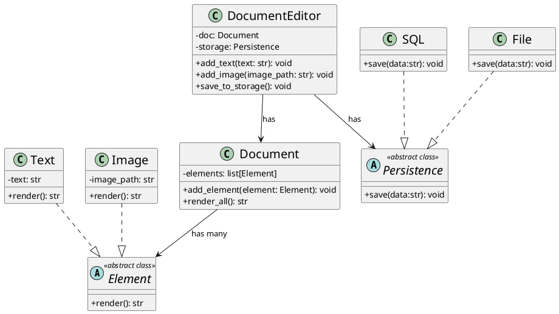

### Requirement

- User should able to add text,image
- Design in such a way user should able to other kinds of element
- Save the document to a db or file

### UML




### Code

```py
from abc import ABC, abstractmethod


class Element(ABC):
    @abstractmethod
    def render(self) -> str:
        pass


class Text(Element):
    def __init__(self, txt: str) -> None:
        self.__text = txt

    def render(self) -> str:
        return self.__text


class Image(Element):
    def __init__(self, image_path: str) -> None:
        self.__image_path = image_path

    def render(self) -> str:
        return f"[image : {self.__image_path}]"


class Persistence(ABC):
    @abstractmethod
    def save(self, data: str) -> None:
        pass


class SQL(Persistence):
    def save(self, data: str) -> None:
        print("saving data to sql db")


class File(Persistence):
    def save(self, data: str) -> None:
        print("saving data to file")


class Document:
    def __init__(self) -> None:
        self.__elements: list[Element] = []

    def add_element(self, element: Element) -> None:
        self.__elements.append(element)

    def render_all(self) -> str:
        res = ""
        for element in self.__elements:
            res += element.render()
        return res


class DocumentEditor:
    def __init__(self, doc: Document, storage: Persistence) -> None:
        self.__doc = doc
        self.__storage = storage

    def add_text(self, txt: str) -> None:
        self.__doc.add_element(Text(txt))

    def add_image(self, image_path: str) -> None:
        self.__doc.add_element(Image(image_path))

    def save(self) -> None:
        data = self.__doc.render_all()
        self.__storage.save(data)


# Usage
if __name__ == "__main__":
    document = Document()
    storage = File()
    editor = DocumentEditor(document, storage)
    editor.add_text("Hello, world!")
    editor.add_image("path/to/image.jpg")
    editor.save()
```
