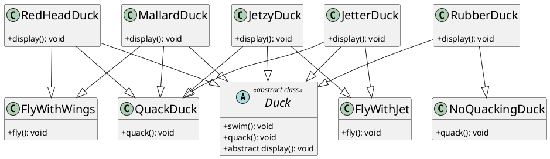
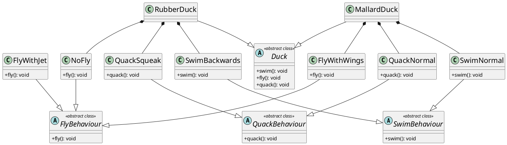

# Strategy Pattern

> Defines a family of algorithm,encapsulates each one and makes them interchangeble.
> We can change the strategy at runtime

### Example

Imagine this scenario we are a company making duck simulator app.
We have a following code setup below.We have a duck abstract
class which gets inherited by different kinds of duck.Currently
quack,swim function is defined in the parent class but since each
duck look differently they override the display method respectively.
Currently we are having pure inheritance based setup.

```py
from abc import ABC, abstractmethod


class Duck(ABC):
    def quack(self):
        print("quack")

    def swim(self):
        print("swim")

    @abstractmethod
    def display(self):
        pass


class MallardDuck(Duck):
    def display(self):
        print("I am MallardDuck")


class RedHeadDuck(Duck):
    def display(self):
        print("I am RedHeadDuck")


class RubberDuck(Duck):
    def display(self):
        print("I am RubberDuck")
```

But suddenly a requirements come up and we have to integrate a
fly method but there is one problem not all ducks fly what we can
do is that add another normal class called flyable duck and make
the mallard,red head duck inherit it.What we can do is define the
fly behaviour over the flyable duck class.Then the code will look
something like this.

```py
from abc import ABC, abstractmethod


class Duck(ABC):
    def quack(self):
        print("quack")

    def swim(self):
        print("swim")

    @abstractmethod
    def display(self):
        pass


class Flyable:
    def fly(self):
        print("fly")


class MallardDuck(Duck, Flyable):
    def display(self):
        print("I am MallardDuck")


class RedHeadDuck(Duck, Flyable):
    def display(self):
        print("I am RedHeadDuck")


class RubberDuck(Duck):
    def display(self):
        print("I am RubberDuck")
```

But there is a problem because suppose we integrate some other
ducks that fly with jet.Then again if we use inheritance then
we have to again create 2 seperate classes flywithwing and
flywithJet which in the long run will create a mess as for
single behaviour(fly behaviour) we can multiple implementations
and it will be a burden to maintain this.

### Inheritance Mess




After careful analysis what we can do is extrac the behaviour that
is changing and encapsulate it into classes.We can use composition
in place of inheritance as it will help us change duck behaviour
in runtime.We are going to extract swim,fly and quack behaviour as
it varies from duck to duck

```py
from abc import ABC, abstractmethod


class SwimBehaviour(ABC):
    @abstractmethod
    def swim(self):
        pass


class SwimNormal(SwimBehaviour):
    def swim(self):
        print("swim normally")


class SwimBackwards(SwimBehaviour):
    def swim(self):
        print("swim backwards manner")


class FlyBehaviour(ABC):
    @abstractmethod
    def fly(self):
        pass


class FlyWithWings(FlyBehaviour):
    def fly(self):
        print("fly with wings")


class FlyWithJet(FlyBehaviour):
    def fly(self):
        print("fly with jet")


class NoFly(FlyBehaviour):
    def fly(self):
        print("cant fly")


class QuackBehaviour(ABC):
    @abstractmethod
    def quack(self):
        pass


class QuackNormal(QuackBehaviour):
    def quack(self):
        print("quack")


class QuackSqueak(QuackBehaviour):
    def quack(self):
        print("squeak")


class Duck(ABC):
    def __init__(self, s: SwimBehaviour, f: FlyBehaviour, q: QuackBehaviour) -> None:
        self.s: SwimBehaviour = s
        self.f: FlyBehaviour = f
        self.q: QuackBehaviour = q

    def swim(self):
        self.s.swim()

    def fly(self):
        self.f.fly()

    def quack(self):
        self.q.quack()


class MallardDuck(Duck):
    def __init__(self, s: SwimBehaviour, f: FlyBehaviour, q: QuackBehaviour) -> None:
        super().__init__(s, f, q)


class RubberDuck(Duck):
    def __init__(self, s: SwimBehaviour, f: FlyBehaviour, q: QuackBehaviour) -> None:
        super().__init__(s, f, q)


if __name__ == "__main__":
    md = MallardDuck(SwimNormal(), FlyWithWings(), QuackNormal())
    rd = RubberDuck(SwimBackwards(), NoFly(), QuackSqueak())
```

### UML with Strategy Pattern applied



