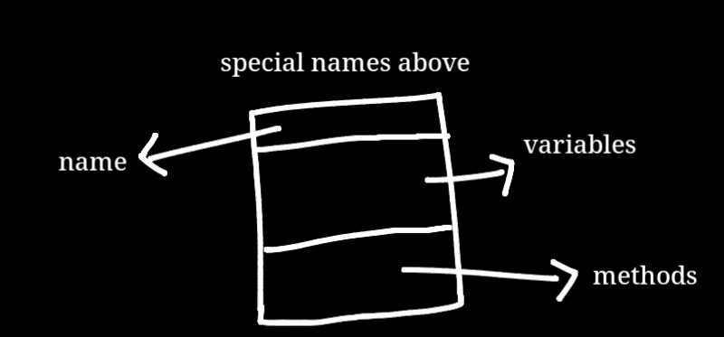
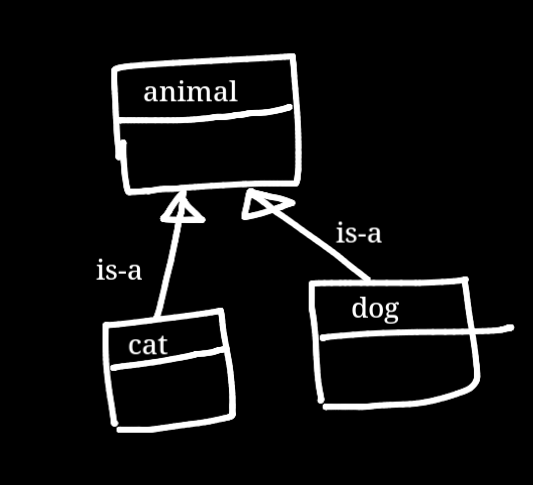
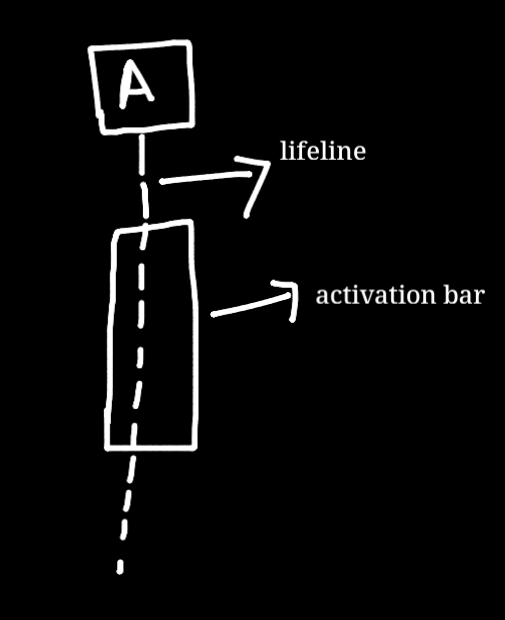
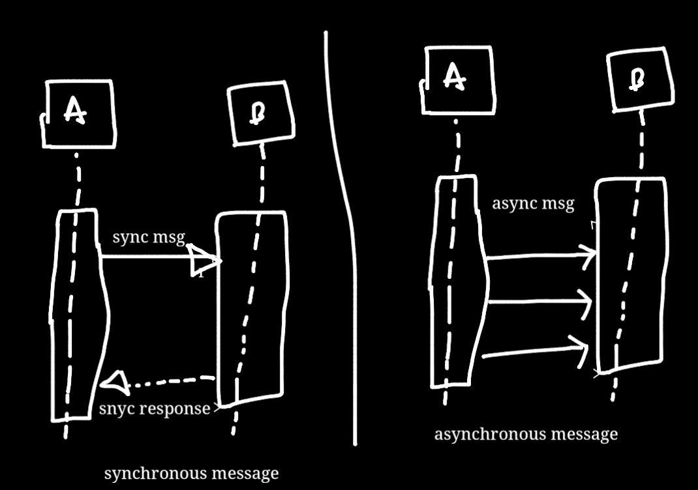
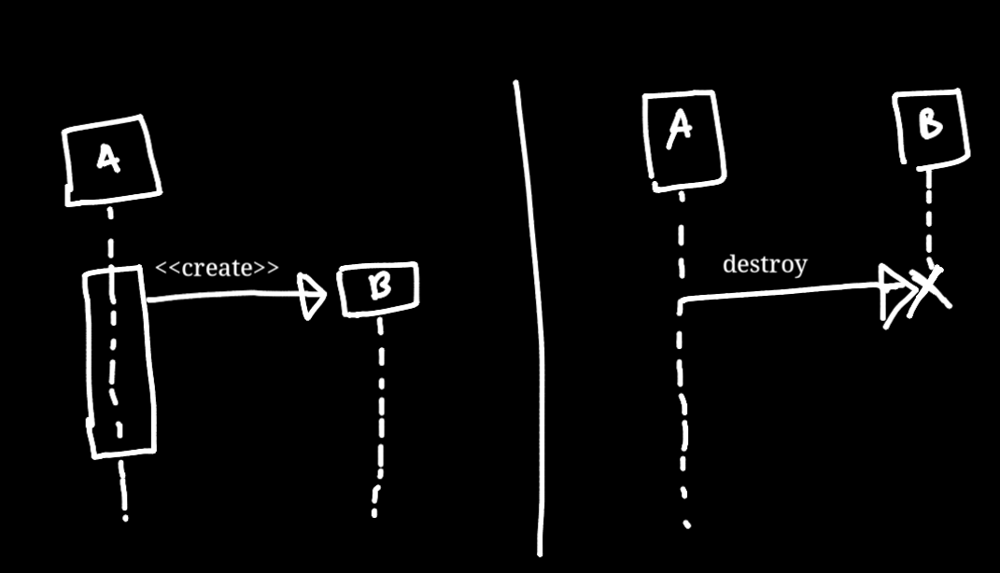
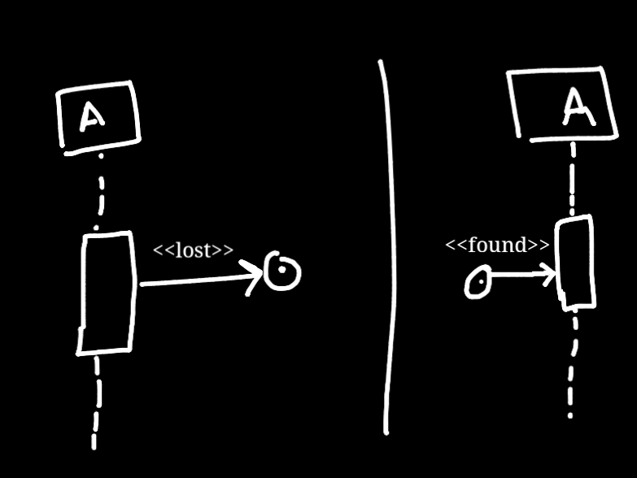

# UML

### Types of diagram (most commonly used)

- **Structural** (class diagrams represent classes and their relationships)
- **Behaviour** (sequence diagrams show how different objects interact with each other)

## Class Diagram

- User `+` for public member/method
- User `-` for private member/method
- User `#` for protected member/method

### Association Types

- **Class Association**

    - **Inheritance (extends) (is-a relation)**
        - Example: Example: A dog is a animal,A cat is a animal.

    

- **Object Association (has-a/uses-a relationship)**

    - **Simple** : A general relationship between two classes where one class uses or interacts with another.

        - **Example** : XYZ person has a house
        - **Example** : XYZ person has a car
        - **Example** : Customer and Order
        - **Example** : Student and Course

    - **Aggregation** : In this type of relation we have a parent/aggregator object inside which we have small objects.
      Each components in this relation can exist individually.

        - **Example** : A room consisits of sofa,bed,chair.A library has books. Each components can exist individually.
        - **Example** : A sports team consisting of players
        - **Example** : A car has an engine, but the engine can exist independently and be used in different cars.

    - **Composition** : In this type of relation we have a main object,and some other small objects,these small objects
      cannot exist individually without the main object.
        - **Example** : A house is made up of rooms, and if the house is destroyed, the rooms cease to exist as well.
        - **Example** : Parts of a chair -> arms,wheels
        - **Example** : A human body contains a heart. If the body is no longer alive, the heart cannot function independently.
        - **Example** : A computer consists of a motherboard. If the computer is dismantled, the motherboard is no longer part of a functioning system.

    

## Sequence Diagram

- **Lifeline** : Lifeline indicates the existence of an object over time during the interaction
- **Activation bar** : Indicates the period during which an object is active

> Types of messages

- **Synchronous message**
- **Asynchronous message**

- **Create Msg**
- **Destroy Msg**

- **Lost Msg**
- **Found Msg**

### Basic Sequence Diagram of ATM transaction

- User will insert card
- ATM will ask for pin
- User will enter pin
- if wrong pin inserted then end
- if right pin inserted then validate pin with bank
- atm asks select transaction type
- user enters withdraw
- atm speak with bank server and checks amount availibility
- if available create transaction & dispense cash
- if not available end

@startuml
skinparam defaultFontSize 20
skinparam ParticipantPadding 20
skinparam Shadowing false
skinparam SequenceMessageAlign center
skinparam participantNameAlignment top

participant User as "ATM User"
participant ATM as "ATM Machine"
participant Transaction as "Transaction"
participant Bank as "Bank Server"

activate ATM
activate User
User -> ATM : Insert Card
ATM -> User : Request PIN
User -> ATM : Enter PIN

activate Bank
ATM -> Bank : Validate PIN

alt#Gold #LightBlue Correct PIN
Bank -> ATM : PIN Validated

    activate Transaction
    ATM -> Transaction : <<Create Transaction>>
    Transaction -> ATM : Get Transaction Type

    ATM -> User : Select Transaction Type
    User -> ATM : Request Withdraw Cash

    ATM -> Transaction : Check Cash Availability
    Transaction -> Bank : Check Cash Availability

    alt#Gold #Orange Cash Available
        Bank -> Transaction : Cash is Available
        Transaction -> ATM : Cash is Available
        ATM -> User : Dispense Cash
        User -> ATM : Collect Cash
        ATM -> User : Eject Card
    else #Grey Cash Unavailable
        Bank -> Transaction : Cash is Unavailable
        Transaction -> ATM : Cash is Unavailable
        ATM -> User : Eject Card
    end

    destroy Transaction
    deactivate Transaction

else #Pink Wrong PIN
Bank -> ATM : Wrong PIN Entered
ATM -> User : Eject Card
end

deactivate Bank
deactivate ATM
deactivate User

@enduml
