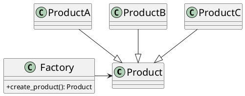
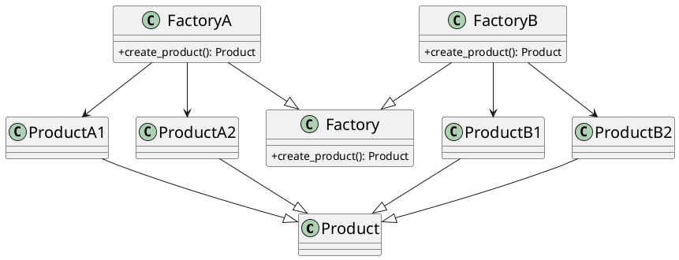
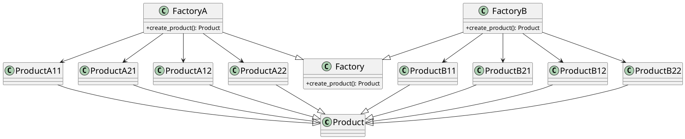

# Simple Factory

> Provides us a factory class which decides which concrete class to create
> Its not a design pattern but just a principle

### Example

Imagine we have a pizza store which on getting an order of pizza of
specfic type starts preparing the pizza and does the other jobs like
baking,cutting,boxing,etc.

```py
from abc import ABC, abstractmethod
from enum import Enum


class Pizza(ABC):
    @abstractmethod
    def prepare(self):
        pass

    @abstractmethod
    def bake(self):
        pass

    @abstractmethod
    def cut(self):
        pass

    @abstractmethod
    def box(self):
        pass


class CheesePizza(Pizza):
    def prepare(self):
        print("Preparing cheese pizza...")

    def bake(self):
        print("Baking cheese pizza...")

    def cut(self):
        print("Cutting cheese pizza...")

    def box(self):
        print("Boxing cheese pizza...")


class PepporoniPizza(Pizza):
    def prepare(self):
        print("Preparing pepperoni pizza...")

    def bake(self):
        print("Baking pepperoni pizza...")

    def cut(self):
        print("Cutting pepperoni pizza...")

    def box(self):
        print("Boxing pepperoni pizza...")


class ClamPizza(Pizza):
    def prepare(self):
        print("Preparing clam pizza...")

    def bake(self):
        print("Baking clam pizza...")

    def cut(self):
        print("Cutting clam pizza...")

    def box(self):
        print("Boxing clam pizza...")


class VeggiePizza(Pizza):
    def prepare(self):
        print("Preparing veggie pizza...")

    def bake(self):
        print("Baking veggie pizza...")

    def cut(self):
        print("Cutting veggie pizza...")

    def box(self):
        print("Boxing veggie pizza...")


class PizzaType(Enum):
    Cheese = "cheese"
    Pepporoni = "pepporoni"
    Clam = "clam"
    Veggie = "veggie"


class PizzaStore:
    def create_order(self, pizza_type: "PizzaType"):
        p: Pizza | None = None

        if pizza_type == PizzaType.Cheese:
            p = CheesePizza()
        elif pizza_type == PizzaType.Pepporoni:
            p = PepporoniPizza()
        elif pizza_type == PizzaType.Clam:
            p = ClamPizza()
        elif pizza_type == PizzaType.Veggie:
            p = VeggiePizza()
        else:
            print("Invalid pizza type")
            return

        p.prepare()
        p.bake()
        p.cut()
        p.box()
```

There is a downside of above design as the PizzaStore class has to be modified
everytime a new pizza type is added and we will be breaking OCP principle instead
we should use a seperate factory class to create the instances of the pizza, by doing
this we are making the create_order method closed for modification following OCP.

```py
from abc import ABC, abstractmethod
from enum import Enum


class Pizza(ABC):
    @abstractmethod
    def prepare(self):
        pass

    @abstractmethod
    def bake(self):
        pass

    @abstractmethod
    def cut(self):
        pass

    @abstractmethod
    def box(self):
        pass


class CheesePizza(Pizza):
    def prepare(self):
        print("Preparing cheese pizza...")

    def bake(self):
        print("Baking cheese pizza...")

    def cut(self):
        print("Cutting cheese pizza...")

    def box(self):
        print("Boxing cheese pizza...")


class PepporoniPizza(Pizza):
    def prepare(self):
        print("Preparing pepperoni pizza...")

    def bake(self):
        print("Baking pepperoni pizza...")

    def cut(self):
        print("Cutting pepperoni pizza...")

    def box(self):
        print("Boxing pepperoni pizza...")


class ClamPizza(Pizza):
    def prepare(self):
        print("Preparing clam pizza...")

    def bake(self):
        print("Baking clam pizza...")

    def cut(self):
        print("Cutting clam pizza...")

    def box(self):
        print("Boxing clam pizza...")


class VeggiePizza(Pizza):
    def prepare(self):
        print("Preparing veggie pizza...")

    def bake(self):
        print("Baking veggie pizza...")

    def cut(self):
        print("Cutting veggie pizza...")

    def box(self):
        print("Boxing veggie pizza...")


class PizzaType(Enum):
    Cheese = "cheese"
    Pepporoni = "pepporoni"
    Clam = "clam"
    Veggie = "veggie"


class SimplePizzaFactory:
    def create_pizza(self, pizza_type: "PizzaType") -> Pizza:
        if pizza_type == PizzaType.Cheese:
            return CheesePizza()
        elif pizza_type == PizzaType.Pepporoni:
            return PepporoniPizza()
        elif pizza_type == PizzaType.Clam:
            return ClamPizza()
        elif pizza_type == PizzaType.Veggie:
            return VeggiePizza()
        else:
            raise Exception("Invalid pizza type")


class PizzaStore:
    def __init__(self, pf: SimplePizzaFactory) -> None:
        self.pf: SimplePizzaFactory = pf

    def create_order(self, pizza_type: "PizzaType"):
        p: Pizza = self.pf.create_pizza(pizza_type)
        p.prepare()
        p.bake()
        p.cut()
        p.box()


if __name__ == "__main__":
    pf = SimplePizzaFactory()
    store = PizzaStore(pf)

    store.create_order(PizzaType.Cheese)
    print()

    store.create_order(PizzaType.Pepporoni)
    print()

    store.create_order(PizzaType.Clam)
    print()

    store.create_order(PizzaType.Veggie)

    try:
        store.create_order("Invalid Pizza Type")
    except Exception as e:
        print(f"\nError: {e}")
```

### StandardUML




# Factory method

> Defines an interface for creating objects but allows subclass to decide
> which concrete class to instantiate

### Example

Imagine now we want to create franchise of our store in NewYork and California,
so we can just extend out Simple factory design and use factory method.But first
lets understand the current scenario.Out pizza store more or less sells 4 variants
of pizza veggie,clam,cheese,pepporoni based but for different region it will be in
different form for example new yorkers when ordeing cheese pizza they mean less cheese
whereas californians when ordering cheese pizza they mean more pizza.Below code shows
how to extend our previous design to support factory method.

```py
from abc import ABC, abstractmethod
from enum import Enum


class Pizza(ABC):
    def __init__(self, name: str, dough: str, sauce: str, topppings: list[str]) -> None:
        self.name = name
        self.dough = dough
        self.sauce = sauce
        self.topppings = topppings

    @abstractmethod
    def prepare(self):
        print(f"preapring {self.name}")
        print(f"toss {self.dough}")
        print(f"add {self.sauce}")
        for topping in self.topppings:
            print(f"add {topping}")

    @abstractmethod
    def bake(self):
        pass

    def cut(self):
        print("cut pizza diagonally")

    def box(self):
        print(f"put {self.name} into offical boxes")


class PizzaType(Enum):
    Cheese = "cheese"
    Pepporoni = "pepporoni"
    Clam = "clam"
    Veggie = "veggie"


class PizzaStore(ABC):
    @abstractmethod
    def create_pizza(self, pizza_type: "PizzaType") -> Pizza:
        pass

    def create_order(self, pizza_type: "PizzaType"):
        p: Pizza = self.create_pizza(pizza_type)
        p.prepare()
        p.bake()
        p.cut()
        p.box()


class NYCheesePizza(Pizza):
    def __init__(self) -> None:
        super().__init__(
            "NY Cheese Pizza", "NY-style dough", "Tomato sauce", ["Mozzarella cheese"]
        )

    def prepare(self):
        print(f"preparing {self.name}")
        print(f"toss {self.dough} in a NY-style")
        print(f"add {self.sauce}")
        for topping in self.topppings:
            print(f"add {topping}")

    def bake(self):
        print("bake NY-style pizza for 20 mins at 400")


class NYPepporoniPizza(Pizza):
    def __init__(self) -> None:
        super().__init__(
            "NY Pepporoni Pizza",
            "NY-style dough",
            "Tomato sauce",
            ["Mozzarella cheese", "Pepporoni"],
        )

    def prepare(self):
        print(f"preparing {self.name}")
        print(f"toss {self.dough} in a NY-style")
        print(f"add {self.sauce}")
        for topping in self.topppings:
            print(f"add {topping}")

    def bake(self):
        print("bake NY-style pizza for 20 mins at 400")


class NYClamPizza(Pizza):
    def __init__(self) -> None:
        super().__init__(
            "NY Clam Pizza",
            "NY-style dough",
            "Tomato sauce",
            ["Mozzarella cheese", "Clams"],
        )

    def prepare(self):
        print(f"preparing {self.name}")
        print(f"toss {self.dough} in a NY-style")
        print(f"add {self.sauce}")
        for topping in self.topppings:
            print(f"add {topping}")

    def bake(self):
        print("bake NY-style pizza for 20 mins at 400")


class NYVeggiePizza(Pizza):
    def __init__(self) -> None:
        super().__init__(
            "NY Veggie Pizza",
            "NY-style dough",
            "Tomato sauce",
            ["Mozzarella cheese", "Vegetables"],
        )

    def prepare(self):
        print(f"preparing {self.name}")
        print(f"toss {self.dough} in a NY-style")
        print(f"add {self.sauce}")
        for topping in self.topppings:
            print(f"add {topping}")

    def bake(self):
        print("bake NY-style pizza for 20 mins at 400")


class CaliCheesePizza(Pizza):
    def __init__(self) -> None:
        super().__init__(
            "Cali Cheese Pizza",
            "Cali-style dough",
            "Pesto sauce",
            ["Mozzarella cheese"],
        )

    def prepare(self):
        print(f"preparing {self.name}")
        print(f"toss {self.dough} in a Cali-style")
        print(f"add {self.sauce}")
        for topping in self.topppings:
            print(f"add {topping}")

    def bake(self):
        print("bake Cali-style pizza for 25 mins at 425")


class CaliPepporoniPizza(Pizza):
    def __init__(self) -> None:
        super().__init__(
            "Cali Pepporoni Pizza",
            "Cali-style dough",
            "Pesto sauce",
            ["Mozzarella cheese", "Pepporoni"],
        )

    def prepare(self):
        print(f"preparing {self.name}")
        print(f"toss {self.dough} in a Cali-style")
        print(f"add {self.sauce}")
        for topping in self.topppings:
            print(f"add {topping}")

    def bake(self):
        print("bake Cali-style pizza for 25 mins at 425")


class CaliClamPizza(Pizza):
    def __init__(self) -> None:
        super().__init__(
            "Cali Clam Pizza",
            "Cali-style dough",
            "Pesto sauce",
            ["Mozzarella cheese", "Clams"],
        )

    def prepare(self):
        print(f"preparing {self.name}")
        print(f"toss {self.dough} in a Cali-style")
        print(f"add {self.sauce}")
        for topping in self.topppings:
            print(f"add {topping}")

    def bake(self):
        print("bake Cali-style pizza for 25 mins at 425")


class CaliVeggiePizza(Pizza):
    def __init__(self) -> None:
        super().__init__(
            "Cali Veggie Pizza",
            "Cali-style dough",
            "Pesto sauce",
            ["Mozzarella cheese", "Vegetables"],
        )

    def prepare(self):
        print(f"preparing {self.name}")
        print(f"toss {self.dough} in a Cali-style")
        print(f"add {self.sauce}")
        for topping in self.topppings:
            print(f"add {topping}")

    def bake(self):
        print("bake Cali-style pizza for 25 mins at 425")


class NYPizzaStore(PizzaStore):
    def create_pizza(self, pizza_type: "PizzaType") -> Pizza:
        if pizza_type == PizzaType.Cheese:
            return NYCheesePizza()
        elif pizza_type == PizzaType.Pepporoni:
            return NYPepporoniPizza()
        elif pizza_type == PizzaType.Clam:
            return NYClamPizza()
        elif pizza_type == PizzaType.Veggie:
            return NYVeggiePizza()
        else:
            raise Exception("Invalid pizza type")


class CaliforniaPizzaStore(PizzaStore):
    def create_pizza(self, pizza_type: "PizzaType") -> Pizza:
        if pizza_type == PizzaType.Cheese:
            return CaliCheesePizza()
        elif pizza_type == PizzaType.Pepporoni:
            return CaliPepporoniPizza()
        elif pizza_type == PizzaType.Clam:
            return CaliClamPizza()
        elif pizza_type == PizzaType.Veggie:
            return CaliVeggiePizza()
        else:
            raise Exception("Invalid pizza type")


# Example usage:
if __name__ == "__main__":
    ny_store = NYPizzaStore()
    cali_store = CaliforniaPizzaStore()

    ny_cheese_pizza = ny_store.create_order(PizzaType.Cheese)
    print("\n")
    cali_cheese_pizza = cali_store.create_order(PizzaType.Cheese)

    ny_pepperoni_pizza = ny_store.create_order(PizzaType.Pepporoni)
    print("\n")
    cali_pepperoni_pizza = cali_store.create_order(PizzaType.Pepporoni)

    ny_clam_pizza = ny_store.create_order(PizzaType.Clam)
    print("\n")
    cali_clam_pizza = cali_store.create_order(PizzaType.Clam)

    ny_veggie_pizza = ny_store.create_order(PizzaType.Veggie)
    print("\n")
    cali_veggie_pizza = cali_store.create_order(PizzaType.Veggie)
```

### StandardUML




# Abstract Factory

> Provides inteface for creating families of related object without specfying concrete classes

### Example

Suppose in our pizza store ,different kind of pizza will have different ingredients as
different regions will use different ingredients to make the pizza.

```py
from abc import ABC, abstractmethod
from enum import Enum


class PizzaIngridentFactory(ABC):
    def __init__(self):
        self.dough: str = ""
        self.sauce: str = ""
        self.cheese: str = ""
        self.veggies: list[str] = []
        self.pepporoni: str = ""
        self.clam = ""

    @abstractmethod
    def add_dough(self) -> str:
        pass

    @abstractmethod
    def add_sauce(self) -> str:
        pass

    @abstractmethod
    def add_cheese(self) -> str:
        pass

    @abstractmethod
    def add_veggies(self) -> list[str]:
        pass

    @abstractmethod
    def add_pepporoni(self) -> str:
        pass

    @abstractmethod
    def add_clams(self) -> str:
        pass


class NYStylePizzaIngredientFactory(PizzaIngridentFactory):
    def __init__(self):
        super().__init__()

    def add_dough(self) -> str:
        self.dough = "NY-style dough"
        return self.dough

    def add_sauce(self) -> str:
        self.sauce = "Tomato sauce"
        return self.sauce

    def add_cheese(self) -> str:
        self.cheese = "Mozzarella cheese"
        return self.cheese

    def add_pepporoni(self) -> str:
        self.pepporoni = "Fresh Pepporoni"
        return self.pepporoni

    def add_veggies(self) -> list[str]:
        self.veggies = ["Onions", "Peppers"]
        return self.veggies

    def add_clams(self) -> str:
        self.clam = "Fresh clams from Long Island Sound"
        return self.clam


class CaliforniaStylePizzaIngredientFactory(PizzaIngridentFactory):
    def __init__(self):
        super().__init__()

    def add_dough(self) -> str:
        self.dough = "Cali-style dough"
        return self.dough

    def add_sauce(self) -> str:
        self.sauce = "Pesto sauce"
        return self.sauce

    def add_cheese(self) -> str:
        self.cheese = "Ricotta cheese"
        return self.cheese

    def add_pepporoni(self) -> str:
        self.pepporoni = "Fresh Pepporoni"
        return self.pepporoni

    def add_veggies(self) -> list[str]:
        self.veggies = ["Spinach", "Mushrooms"]
        return self.veggies

    def add_clams(self) -> str:
        self.clam = "Fresh clams from California coast"
        return self.clam


class Pizza(ABC):
    def __init__(self, name: str, pif: PizzaIngridentFactory) -> None:
        self.name = name
        self.pif = pif

    @abstractmethod
    def prepare(self):
        pass

    @abstractmethod
    def bake(self):
        pass

    def cut(self):
        print("Cutting pizza...")

    def box(self):
        print("Boxing pizza...")


class CheesePizza(Pizza):
    def __init__(self, name: str, pif: PizzaIngridentFactory) -> None:
        super().__init__(name, pif)

    def prepare(self):
        print(f"Preparing {self.name} cheese pizza...")
        self.pif.add_dough()
        self.pif.add_sauce()
        self.pif.add_cheese()
        print(
            f"Adding ingredients: {self.pif.dough}, {self.pif.sauce}, {self.pif.cheese}"
        )

    def bake(self):
        print(f"Baking {self.name} cheese pizza...")


class PepporoniPizza(Pizza):
    def __init__(self, name: str, pif: PizzaIngridentFactory) -> None:
        super().__init__(name, pif)

    def prepare(self):
        print(f"Preparing {self.name} pepperoni pizza...")
        self.pif.add_dough()
        self.pif.add_sauce()
        self.pif.add_cheese()
        self.pif.add_pepporoni()
        print(
            f"Adding ingredients: {self.pif.dough}, {self.pif.sauce}, {self.pif.cheese}, {self.pif.pepporoni}"
        )

    def bake(self):
        print(f"Baking {self.name} pepperoni pizza...")


class ClamPizza(Pizza):
    def __init__(self, name: str, pif: PizzaIngridentFactory) -> None:
        super().__init__(name, pif)

    def prepare(self):
        print(f"Preparing {self.name} clam pizza...")
        self.pif.add_dough()
        self.pif.add_sauce()
        self.pif.add_cheese()
        self.pif.add_clams()
        self.pif.add_veggies()
        print(
            f"Adding ingredients: {self.pif.dough}, {self.pif.sauce}, {self.pif.cheese}, {self.pif.clam}, {self.pif.veggies}"
        )

    def bake(self):
        print(f"Baking {self.name} clam pizza...")


class VeggiePizza(Pizza):
    def __init__(self, name: str, pif: PizzaIngridentFactory) -> None:
        super().__init__(name, pif)

    def prepare(self):
        print(f"Preparing {self.name} veggie pizza...")
        self.pif.add_dough()
        self.pif.add_sauce()
        self.pif.add_cheese()
        self.pif.add_veggies()
        print(
            f"Adding ingredients: {self.pif.dough}, {self.pif.sauce}, {self.pif.cheese}, {self.pif.veggies}"
        )

    def bake(self):
        print(f"Baking {self.name} veggie pizza...")


class PizzaType(Enum):
    Cheese = "cheese"
    Pepporoni = "pepporoni"
    Clam = "clam"
    Veggie = "veggie"


class PizzaStore(ABC):
    @abstractmethod
    def create_pizza(self, pizza_type: "PizzaType", name: str) -> Pizza:
        pass

    def create_order(self, pizza_type: "PizzaType", name: str):
        p = self.create_pizza(pizza_type, name)
        p.prepare()
        p.bake()
        p.cut()
        p.box()


class NYPizzaStore(PizzaStore):
    def create_pizza(self, pizza_type: "PizzaType", name: str) -> Pizza:
        pif = NYStylePizzaIngredientFactory()
        if pizza_type == PizzaType.Cheese:
            return CheesePizza(name, pif)
        elif pizza_type == PizzaType.Pepporoni:
            return PepporoniPizza(name, pif)
        elif pizza_type == PizzaType.Clam:
            return ClamPizza(name, pif)
        elif pizza_type == PizzaType.Veggie:
            return VeggiePizza(name, pif)


class CaliPizzaStore(PizzaStore):
    def create_pizza(self, pizza_type: "PizzaType", name: str) -> Pizza:
        pif = CaliforniaStylePizzaIngredientFactory()
        if pizza_type == PizzaType.Cheese:
            return CheesePizza(name, pif)
        elif pizza_type == PizzaType.Pepporoni:
            return PepporoniPizza(name, pif)
        elif pizza_type == PizzaType.Clam:
            return ClamPizza(name, pif)
        elif pizza_type == PizzaType.Veggie:
            return VeggiePizza(name, pif)


if __name__ == "__main__":
    ny_store = NYPizzaStore()
    cali_store = CaliPizzaStore()

    ny_store.create_order(PizzaType.Cheese, "New York Style Cheese Pizza")
    print()

    cali_store.create_order(PizzaType.Clam, "California Style Clam Pizza")
    print()

    ny_store.create_order(PizzaType.Pepporoni, "NY Style Pepporoni Pizza")
    print()

    cali_store.create_order(PizzaType.Veggie, "Cali Veggie Pizza")
```

### StandardUML



